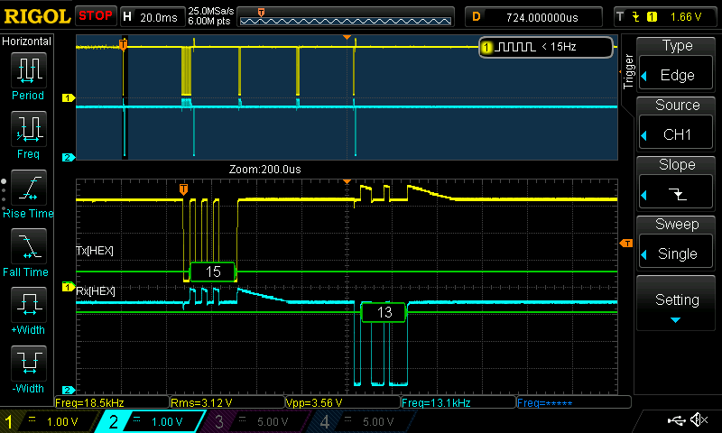

# SendVar38k

> With hollyhock, we have full control over the serial port. But with CasioBasic, we can only send and receive stuff in casios strange format.
> I document this to make it possible to send and receive data between an Arduino or ESP and an **unmodified** calc, 
> or between a calc with hollyhock and an unmodified calc.

The `SendVar38k` and `GetVar38k` basic commands can be used for serial communication at a speed of 38400 baud.
At first, you need to open the port with the command `OpenComPort38k` (and at the end you can close it with `CloseComPort38k`, I think...).

The casiobasic command `SendVar38k <varname>` sends the content of the variable `<varname>` over the 3-pin serial port. 
The command will always execute without any problems, no matter if the data was actually received or not.

The casiobasic command `GetVar38k <varname>` **waits** until a value is received, then this value will be saved and the execution of the program will continue.

As you can see, there is no option of checking if something was send, so if your program shouldn't lock up, make sure the other device will always send something like `""`.
In my program, the calc will send something, right before it executes the GetVar38k command. This way one calc will always wait while the other one does it's calculations.
When it's done, it'll send the result (the user input or empty string) to the other calc, 
which will continue it's operation, print that out, and then does the same thing all over again.

I used this program on a Classpad II and no an old Classpad 300, connected via a serial cable where I hooked my oscilloscope to.
```
OpenComPort38k

While true
  ""⇒sendstr
  
  'if any key is pressed, ask for user input
  GetKey key
  If key≠0: Then
    InputStr sendstr
    Print sendstr
  IfEnd
  SendVar38k sendstr
  
  'receive the next string and print it if it isn't empty.
  GetVar38k instr
  strcmp instr, "", eq
  If eq≠0: Then 'instr≠"" only works on newer devices
    Print instr
  EndIf
WhileEnd
```

This alone is already a nice little chat program, but my goal was to connect this to an esp8266 wifi module to connect to something like Discord
(See [here](https://github.com/ThatLolaSnail/Simple-ESP-Discord-Bot) for my simple ESP discord bot).

So, now to the topic: The format of the serial communication:

 S: 15  
 R: 13  
 S: 3A  
 S: 4E 44 64 00 01 00 01 **LL LL LL LL** 05 FF **HH** (header)  
 R: 06  
 S: 3A 00 01  
 S: **DATA**  
 S: **SS**  
 R: 06  

**LLLL** is the len of the data including padding in binary (big endian), it is repeated twice.  
**HH** is the header checksum, it is calculated by taking 0x00 and subtracting everything from the header (that line except the checksum) from it.  
**DATA** is the string that is send itself. It is 0 terminated and padded. The padding may consist of 00 or of random numbers.
**SS** is the checksum of the data it is calculated by taking 00 and subtracting 01 (from the previous block) and the whole data with padding from it.

If the data is longer than 0x30 bytes, it is split up into packets, with 11ms space in between.

The whole timing may vary, the newer calc takes much longer to respond with the initial 0x13 than the old calc.


